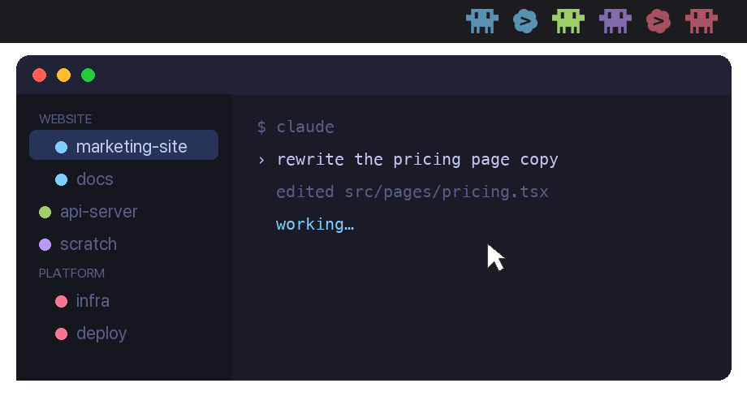

<h1 align="center">Agentique</h1>

<p align="center">
  <b>Every <a href="https://www.cmux.dev/">cmux</a> agent, at a glance.</b>
</p>

<p align="center">
  <a href="https://github.com/clampork/agentique/actions/workflows/ci.yml"></a>
  <a href="https://github.com/clampork/agentique/releases/latest"></a>
  <a href="LICENSE"></a>
  
</p>

<p align="center">
  
</p>

<p align="center">
  <sub>An agent finishes while you are elsewhere. Its glyph brightens, and one click lands you in that Workspace.</sub>
</p>

## Why

The menu bar is the one strip of screen no window covers. Agentique puts your agents
there, so cmux can sit behind your editor or your browser while you work. A glance tells
you which Workspaces are still working and which ones have stopped and are waiting on you.
Clicking a glyph drops you straight into its Workspace.

## What the glyphs mean

A glyph carries three things at once.

**Shape is the agent.** A Workspace running Claude Code draws differently from one running
Codex, so you can see which agent is on which job without reading a label.

**Color is the project, never the state.** Every glyph takes its Workspace's cmux color,
which a Workspace Group shares across its members, so a busy project stays recognizable as
*that* project.

**Brightness and motion are the state.**

| Condition | Treatment |
| --- | --- |
| Agent mid-turn | Pulsing |
| Turn finished, not yet seen | Full brightness |
| Turn finished, already visited | Dimmed |
| Plain terminal, no agent ever loaded | Hidden |

Glyphs dim by color rather than opacity, so a resting one is a darker shade of itself
instead of a translucent one bleeding into the bar behind it.

## Requirements

- **macOS 14 or later.** Agentique builds against 13, but cmux needs 14.
- **Apple Silicon.** The build targets `arm64`.
- **[cmux](https://www.cmux.dev/)**, with at least one Workspace.
- **Xcode Command Line Tools**, for the Swift compiler. Full Xcode also works.

## Install

There is no prebuilt download: shipping a macOS app that opens without a Gatekeeper
warning needs a paid Apple Developer ID. Building it yourself takes seconds and avoids
that.

```sh
xcode-select --install        # skip if you have them
brew install --cask cmux      # skip if you have it

git clone https://github.com/clampork/agentique.git
cd agentique
./build.sh install
```

That compiles the app, copies it to `/Applications`, and registers a launch agent so it
starts at login. Then grant socket access, or the row comes up empty.

### Granting cmux socket access

cmux defaults `automation.socketControlMode` to `cmuxOnly`, which admits only processes
started inside cmux. Agentique runs from `/Applications` under launchd, so it is refused
with `Access denied - only processes started inside cmux can connect`. Add to
`~/.config/cmux/cmux.json`:

```json
{
  "automation": { "socketControlMode": "allowAll" }
}
```

then run `cmux reload-config`.

`allowAll` lets any local process drive cmux. `password` mode is the narrower option,
though Agentique does not yet pass one.

### Checking it worked

Glyphs should appear within a couple of seconds. If the row is empty:

```sh
/Applications/Agentique.app/Contents/MacOS/Agentique --dump
```

Mind the catch: anything launched from a cmux terminal inherits socket access whatever
`socketControlMode` says, so `--dump` can succeed in a cmux shell while the installed app
is still refused. `~/Library/Logs/Agentique.log` records the glyph count once per launch,
which tells the two apart.

### Uninstalling

```sh
./build.sh uninstall
```

## Using it

Click a glyph to jump to its Workspace. Right-click, or click the padding around the
glyphs, to bring up the Workspace list. That's it.

## Custom agent artwork

Drop `Assets/agents/<agent>.<ext>` and rebuild. `pdf`, `svg` and `png` resolve in that
order, and the name matches the agent key cmux uses: `claude`, `codex`, plus `fallback`
for anything else. Missing artwork falls back to a filled circle.

**Design at 256px tall, up to 460px wide, exported as SVG.** Height is the only fixed
dimension: glyphs scale to `glyphSize` and width follows the aspect ratio. Past 1.8:1 a
glyph is fitted by width instead and ends up shorter than its neighbours. Transparent
margins are trimmed on load, so padding is irrelevant, but the *content* bounding box sets
the aspect ratio, so a stray pixel resizes the whole glyph.

Only the alpha channel survives; the shape is flooded with the session color at draw time.
One flat color, no gradients. At 16pt a glyph is 32 physical pixels tall on a 2x display,
so anything under 2px, roughly 16px in a 256px frame, disappears.

## How it works

Lifecycle comes from the cmux agent hooks, and whether a Workspace has an agent at all
comes from cmux's own process tags. Only live signals count, so every visible glyph is a
live agent. [DESIGN.md](DESIGN.md) covers each signal in detail, how the colors are
matched to cmux, and why the state model settled where it did.

## Development

```sh
./build.sh          # compile build/Agentique.app
./build.sh run      # compile, then relaunch from build/
./build.sh install  # compile, copy to /Applications, start at login
./build.sh uninstall
```

No dependencies and no Xcode project: `build.sh` runs `swiftc` over `Sources/*.swift`.

Two flags check behaviour without reading the menu bar:

```sh
build/Agentique.app/Contents/MacOS/Agentique --dump             # the row, as text
build/Agentique.app/Contents/MacOS/Agentique --preview out.png  # the row, over both bar backgrounds
```

Sizing lives at the top of `Sources/GlyphRenderer.swift`: `glyphSize` 16pt, `gap` 10pt,
`height` 18pt. Glyphs are sized against the filled icons sharing the bar, which run about
16pt tall, and the gap is half the roughly 20pt rhythm macOS leaves between status items,
so the row reads as one item rather than several.

Supporting scripts, run from the repository root:

```sh
uv run --with pillow python3 Tools/preview-glyphs.py   # every glyph at true menu bar size
uv run --with pillow python3 Tools/preview-opacity.py  # compare resting-brightness candidates
uv run --with pillow python3 Tools/make-demo.py        # regenerate everything under docs/
swift Tools/rasterize.swift <in.svg|pdf> <out.png> <height>
swift Tools/make-icon.swift                            # regenerate Assets/AppIcon.icns
```

`preview-glyphs.py` and `preview-opacity.py` write to `~/Desktop` and read the live row,
so judge legibility on the actual-size render, not the magnified one.

`docs/social-preview.png` is the card shown when this repository's URL is pasted into a
chat app. GitHub only accepts it through **Settings → General → Social preview**, so
regenerating it is not enough; it has to be re-uploaded by hand.

## License

[MIT](LICENSE). An independent project, not affiliated with cmux.

---

<p align="center">
  
</p>
