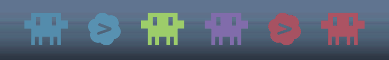
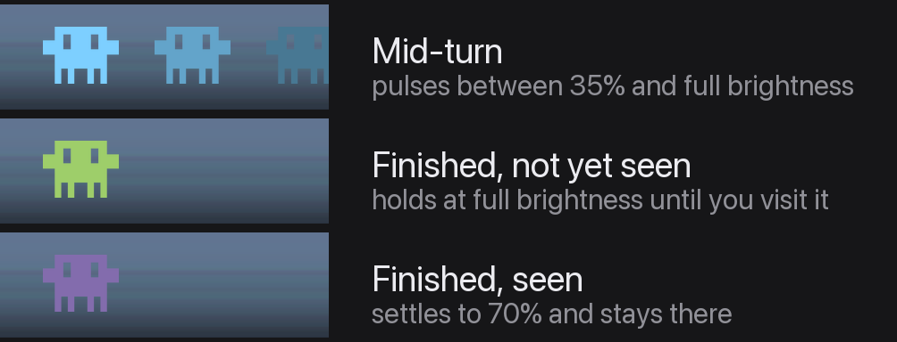

# Agentique

One mark per [cmux](https://www.cmux.dev/) workspace in the macOS menu bar, colored by
project and animated by what its coding agent is doing.

[](https://github.com/clampork/agentique/actions/workflows/ci.yml)
[](https://github.com/clampork/agentique/releases/latest)
[](LICENSE)




Running several coding agents at once means one of them is always finishing while you are
looking at something else. Agentique puts the whole set in the menu bar: which projects
have an agent, which are mid-turn, and which finished while your back was turned.

## What the marks mean



Color is identity, never state. Every mark is drawn in its workspace's cmux color, so a
busy project stays recognizable as *that* project. State rides on brightness and motion
instead:

| Condition | Treatment |
| --- | --- |
| Agent mid-turn | pulsing, 35% to full, over 1.4s |
| Turn finished, not yet seen | full brightness, static |
| Turn finished, already visited | 70%, static |
| Plain terminal, no AI ever loaded | hidden entirely |

Marks are dimmed by color rather than opacity, so a resting mark is a darker shade of
itself at full opacity instead of a translucent one that blends into the bar behind it.

## Requirements

- **macOS 14 Sonoma or later.** Agentique itself builds against macOS 13, but cmux
  requires 14, so 14 is the real floor.
- **Apple Silicon.** The build targets `arm64` only.
- **[cmux](https://www.cmux.dev/)**, with at least one workspace.
- **Xcode Command Line Tools**, for the Swift compiler. Full Xcode works but is not
  needed.

## Install

There is no prebuilt download, because distributing a macOS app that opens without a
Gatekeeper warning requires a paid Apple Developer ID. Building it yourself takes a few
seconds and sidesteps that entirely.

```sh
xcode-select --install        # skip if you already have them
brew install --cask cmux      # skip if cmux is already installed

git clone https://github.com/clampork/agentique.git
cd agentique
./build.sh install
```

`./build.sh install` compiles the app, copies it to `/Applications`, and registers a
launch agent so it starts at login and restarts if it ever exits.

Then grant it socket access, below. Without that step the row comes up empty.

### Granting cmux socket access

cmux defaults `automation.socketControlMode` to `cmuxOnly`, which admits only processes
started inside cmux. Agentique runs from `/Applications` under launchd, so it is refused
with `Access denied - only processes started inside cmux can connect` and draws nothing.
Add this to `~/.config/cmux/cmux.json`:

```json
{
  "automation": { "socketControlMode": "allowAll" }
}
```

then reload:

```sh
cmux reload-config
```

`allowAll` lets any local process drive cmux. If that is too broad, `password` mode plus
`--password` on each call is the narrower alternative, though Agentique does not yet pass
one.

### Checking it worked

Marks should appear in the menu bar within a couple of seconds. If the row is empty:

```sh
/Applications/Agentique.app/Contents/MacOS/Agentique --dump
```

This prints the row as text. Note the catch: anything launched from a cmux terminal
inherits socket access regardless of `socketControlMode`, so running `--dump` from a cmux
shell can succeed while the installed app is still being refused. To tell those cases
apart, check `~/Library/Logs/Agentique.log`, which records the slot count and the status
item's placement once per launch.

### Uninstalling

```sh
./build.sh uninstall
```

Removes the app, the launch agent, and stops the running copy.

## Using it

Click a mark to jump straight to that workspace. Click the padding around the marks, or
right-click anywhere on the item, to open the workspace list instead. The status item has
no attached menu on purpose, since that would make every click open the list.

## Custom agent artwork

Drop `Assets/agents/<agent>.<ext>` and rebuild. `pdf`, `svg` and `png` are resolved in
that order, and the name matches the agent key cmux uses: `claude`, `codex`, plus
`fallback` for anything else cmux integrates with. Missing artwork falls back to a filled
circle.

**Design at 256px tall, up to 460px wide, exported as SVG.** Height is the only fixed
dimension: every mark is scaled to `markSize` and its width follows its aspect ratio. Past
1.8:1 a mark is fitted by width instead and ends up shorter than its neighbours.
Transparent margins are trimmed at load, so padding is irrelevant, but the *content*
bounding box sets the aspect ratio, so a stray pixel resizes the whole mark.

Artwork is used as a silhouette: only the alpha channel survives, filled with the session
color at draw time. One flat color, no gradients or shading. At 16pt a mark is 32 physical
pixels tall on a 2x display, so anything under 2px, about 16px in a 256px frame,
disappears.

## How it works

### Where state comes from

- **Lifecycle**—`~/.cmuxterm/<agent>-hook-sessions.json`, written by the cmux agent hooks.
  Each session carries `agentLifecycle` (`running` | `idle` | `needsInput` | `unknown`),
  `workspaceId` and `pid`. Entries are trusted only while the pid is alive.
- **Agent identity**—the hook filename. Events also carry it as `_source`.
- **Whether an AI is loaded at all**—`cmux top --all --processes` emits a per-workspace
  tag row (`workspace:<uuid>:tag:claude_code`) with a `Running` or `Idle` label. A
  workspace running only a shell emits no tag row, which is what distinguishes a plain
  terminal from a workspace whose agent has exited.
- **Names, order and color**—`cmux workspace list --json --id-format both`, per window.
- **Change detection**—a `DispatchSource` watch on `~/.cmuxterm`, debounced 120ms, with a
  2s poll as a safety net. The hook files are replaced atomically, so the directory is
  what changes. Workspaces, groups and tags refresh every 10s, since `cmux top` samples
  CPU.

`cmux events --category agent --reconnect` is an available alternative source, carrying
the same information plus `workspace_id`. The session files already hold the resolved
lifecycle, so watching them avoids re-deriving state and keeps a subprocess out of the
picture.

Only live signals decide state. Hook files keep finished sessions around for restore, so a
workspace whose agent exited days ago still has history on disk. Trusting that history
resurrected dead workspaces as live agents, which is why nothing but a live session or a
live cmux tag counts now.

### Color

Session color is the workspace's `custom_color`, which cmux shares across a group's
members. On a dark bar it is brightened before drawing, so the shade matches what cmux
itself renders in dark mode rather than the raw hex.

### Design decisions

There is no dimmer "stopped" tier. One existed briefly, but it was only reachable when a
session's process was alive while its lifecycle was `unknown` *and* cmux emitted no tag
for it, a case that essentially never fires. Every visible mark is a live agent, so the
two static levels differ only by whether you have looked at it yet.

An earlier build tinted a working agent in cmux's Amber. It was dropped because it
overrode the session color exactly when you most want to know *which* project is busy, and
because it competed with the workspace colors around it.

A workspace that has never loaded an AI is left out of the row: the row is about agents,
and a plain shell has nothing to report.

"Finished" and "waiting on you" are not separated, because for a coding agent they are the
same condition: a finished turn *is* the agent waiting. What is separated is whether you
have *seen* it. A turn that ends while you are looking elsewhere stays at full brightness
until you visit that workspace, then drops to 70%. A turn that finishes while you are
watching never brightens at all. An earlier build drove this off unread cmux notifications
(`rpc notification.list`, `is_read == false`) instead; that signal is the hook to restore
if visiting ever proves too blunt.

Folders are excluded. cmux models a sidebar folder as a workspace that anchors a group, so
`workspace list` returns folders and real workspaces indistinguishably. The anchors come
from `workspace.group.list` and are filtered out.

`render()` compares a signature of the drawn row before touching the image, so refreshes
and appearance changes that produce an identical row cost nothing.

## Development

```sh
./build.sh          # compile build/Agentique.app
./build.sh run      # compile, then relaunch from build/
./build.sh install  # compile, copy to /Applications, start at login
./build.sh uninstall
```

The app has no dependencies and no Xcode project: `build.sh` runs `swiftc` over
`Sources/*.swift` directly.

Two flags check behaviour without reading the menu bar:

```sh
build/Agentique.app/Contents/MacOS/Agentique --dump              # the row, as text
build/Agentique.app/Contents/MacOS/Agentique --preview out.png   # the row, over both bar backgrounds
```

Sizing lives at the top of `Sources/MarkRenderer.swift`: `markSize` 16pt, `gap` 10pt,
`height` 18pt. The mark is sized against the filled icons sharing the bar, which measure
about 16pt tall. The gap is half the roughly 20pt rhythm macOS leaves between neighbouring
status items, so the row reads as one item rather than several. Spacing is uniform; an
earlier build widened it across a cmux group boundary, but group membership is no longer
drawn.

Supporting scripts, all run from the repository root:

```sh
uv run --with pillow python3 Tools/preview-marks.py    # every mark at true menu bar size
uv run --with pillow python3 Tools/preview-opacity.py  # compare resting-brightness candidates
uv run --with pillow python3 Tools/make-demo.py        # regenerate the images in docs/
swift Tools/rasterize.swift <in.svg|pdf> <out.png> <height>
swift Tools/make-icon.swift                            # regenerate Assets/AppIcon.icns
```

`preview-marks.py` and `preview-opacity.py` write to `~/Desktop` and read the live cmux
row, so judge legibility on the actual-size render rather than the magnified one.

## License

[MIT](LICENSE).

Agentique is an independent project and is not affiliated with or endorsed by the makers
of cmux. The Codex mark in `Assets/agents/codex.svg` is a trademark of OpenAI and is
included only to identify Codex sessions.
